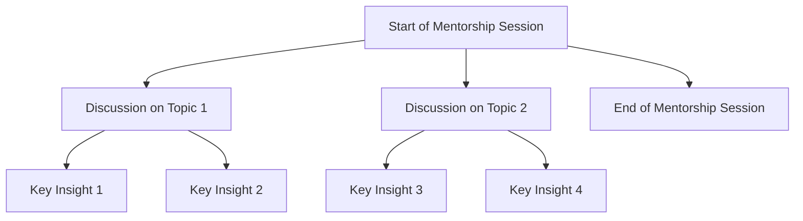

## Topmate and recording

Recently, I participated in an online mentorship and I want to share my experience with you. The mentor used a platform called [Topmate](https://topmate.io/), which offers the video call recording.
Topmate not only facilitates connecting with mentors but also allows you to record the entire mentorship session. After the video call, I received an email with a download link for the recording in MP4 format.  


This is extremely useful as it allows you to review the session later and capture all the important details discussed.

## Converting Audio from MP4 to MP3
To extract the audio from the recording and make transcription easier, I used a Python script that downloads the video from the provided link and then converts the MP4 file to MP3. Here is the updated script:

```python
import requests
from moviepy.editor import VideoFileClip

def download_video(url, output_path):
    response = requests.get(url)
    with open(output_path, 'wb') as file:
        file.write(response.content)

def convert_mp4_to_mp3(mp4_file, mp3_file):
    video_clip = VideoFileClip(mp4_file)
    audio_clip = video_clip.audio
    audio_clip.write_audiofile(mp3_file)
    audio_clip.close()
    video_clip.close()

# Usage of the script
video_url = 'https://topmate-call-recordings.s3.ap-south-1.amazonaws.com/recording_recording_123456-imagine-like-a-guid.mp4'
mp4_file_path = 'mentorship.mp4'
mp3_file_path = 'mentorship.mp3'

download_video(video_url, mp4_file_path)
convert_mp4_to_mp3(mp4_file_path, mp3_file_path)
```

## Transcribing the Audio with Google Cloud Speech-to-Text
After converting the audio, I used Google Cloud Speech-to-Text to transcribe the content. This tool is extremely powerful and offers remarkable accuracy in transcribing audio to text. Here is a basic guide on how to use this tool:

 - Google Cloud Setup: Set up your account on Google Cloud and enable the Speech-to-Text API.
 - Upload the Audio: Upload the MP3 file to Google Cloud Storage.
 - Create a Transcription Request: Use the following Python code to transcribe the audio:

## Google Cloud Speech-to-Text Transcription
Using Google Cloud Speech-to-Text, I was able to transcribe the audio accurately. Here is a snapshot of the transcription configuration and a snippet of the transcribed text:


(transcription result in GCP)
```python
from google.cloud import speech_v1p1beta1 as speech
import os

def transcribe_audio(gcs_uri, output_path):
    client = speech.SpeechClient()
    
    audio = speech.RecognitionAudio(uri=gcs_uri)
    config = speech.RecognitionConfig(
        encoding=speech.RecognitionConfig.AudioEncoding.MP3,
        sample_rate_hertz=16000,
        language_code="en-US",
    )

    response = client.recognize(config=config, audio=audio)

    with open(output_path, 'w') as file:
        for result in response.results:
            file.write(result.alternatives[0].transcript + '\n')

# Using the script
gcs_uri = 'gs://bucket-name/mentorship.mp3'
transcription_output_path = 'audio.txt'
transcribe_audio(gcs_uri, transcription_output_path)

```

Audio Configuration:

 - Audio File: MP3
 - Sample Rate: 44100 Hz
 - Channel Count: 2
 - Billed Audio Time: 31:57
 - Transcription Time: 11:42.8
Transcription Options:

 - Language Code: en-US
 - Transcription Model: Long
 - API Version: v1p1beta1
 - Region: Global
 - Word Confidence: Enabled
 - Automatic Punctuation: Enabled
 - Transcription Accuracy:
 - Transcript with a confidence level of 0.83

```
   if you good afternoon, I don't know where exactly you are based on but
```
##  Extracting Insights with ChatGPT
After obtaining the transcription, I used the ChatGPT-4 model to extract key insights from the mentorship session. ChatGPT-4 is a powerful tool for analyzing text and generating summaries, making it perfect for this task.

##  Using ChatGPT-4 for Insights
Here’s an example of how I used ChatGPT-4 to extract insights:

Load the Transcription: Load the text file containing the transcription.
Ask ChatGPT-4 for Insights: Use the following prompt with ChatGPT-4 to get a summary of the mentorship session:
```python

with open('audio.txt', 'r') as file:
    transcription_text = file.read()

# Example prompt for ChatGPT-4
prompt = f"Here is the transcription of a mentorship session:\n\n{transcription_text}\n\nPlease provide key insights and a summary of the main points discussed."

# Assuming you have a function to interact with ChatGPT-4
insights = get_chatgpt_insights(prompt)
print(insights)
```

##  Generating a Diagram with Mermaid JS
Finally, to visualize the insights from the mentorship session, I used Mermaid JS to create a diagram. Mermaid JS is a JavaScript-based diagramming tool that allows you to create flowcharts, sequence diagrams, and more.

Example Mermaid JS Diagram
Here’s an example of how you can use Mermaid JS to generate a diagram from the insights:



## Conclusions
Using these tools elevated my mentorship experience. The ability to record, convert, and transcribe my sessions allows me to review and study the advice and insights obtained, ensuring no important detail is forgotten.
In addition to taking notes, doing all this helped me practice coding and use other technologies, which is crucial for putting ***acquired knowledge into practice****.

I hope this article was helpful and inspires you to make the most of your mentorship sessions.

Happy coding!
