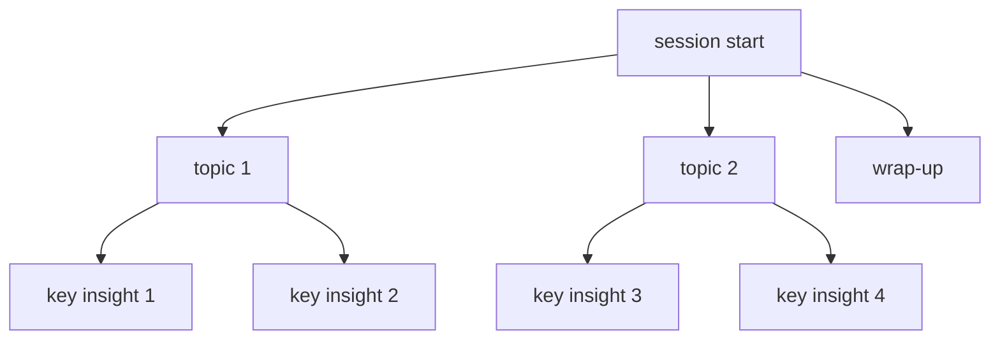

## why record mentorship calls?

i recently joined an online mentorship on [topmate](https://topmate.io/). after the call, topmate emailed me a link to the mp4 recording. having the full session lets me revisit the advice, catch the bits i missed live, and turn a dense hour into working notes.


> quick note on etiquette: make sure everyone on the call knows it's being recorded.

## from mp4 to mp3

to simplify transcription, i pull down the video and extract the audio. this version streams the download (safer for large files) and uses moviepy to write an mp3.

```python
import requests
from moviepy.editor import VideoFileClip

def download_video(url: str, output_path: str) -> None:
    with requests.get(url, stream=True) as r:
        r.raise_for_status()
        with open(output_path, "wb") as f:
            for chunk in r.iter_content(chunk_size=8192):
                if chunk:
                    f.write(chunk)

def convert_mp4_to_mp3(mp4_file: str, mp3_file: str) -> None:
    with VideoFileClip(mp4_file) as clip:
        clip.audio.write_audiofile(mp3_file)

# usage
video_url = "https://topmate-call-recordings.s3.ap-south-1.amazonaws.com/recording_recording_123456-imagine-like-a-guid.mp4"
mp4_file = "mentorship.mp4"
mp3_file = "mentorship.mp3"

download_video(video_url, mp4_file)
convert_mp4_to_mp3(mp4_file, mp3_file)
```

> for best accuracy with speech-to-text, flac or linear16 usually beats mp3. i kept mp3 here to match the original workflow.

## transcribing with google cloud speech-to-text

setup (once):

- create a gcp project and enable the **speech-to-text api**
- upload `mentorship.mp3` to **google cloud storage**
- set `GOOGLE_APPLICATION_CREDENTIALS` to your service account json

here’s a minimal long-audio transcription (31-minute files need the long-running api). i also enabled punctuation and confidence scores.

```python
from google.cloud import speech_v1p1beta1 as speech

def transcribe_gcs(gcs_uri: str, output_path: str) -> None:
    client = speech.SpeechClient()

    audio = speech.RecognitionAudio(uri=gcs_uri)
    config = speech.RecognitionConfig(
        encoding=speech.RecognitionConfig.AudioEncoding.MP3,
        sample_rate_hertz=44100,         # match your file
        language_code="en-US",
        model="long",
        audio_channel_count=2,
        enable_automatic_punctuation=True,
        enable_word_confidence=True,
        # optional diarization (speakers):
        # enable_speaker_diarization=True,
        # diarization_speaker_count=2,
    )

    operation = client.long_running_recognize(config=config, audio=audio)
    response = operation.result(timeout=3600)

    with open(output_path, "w", encoding="utf-8") as f:
        for result in response.results:
            f.write(result.alternatives[0].transcript + "\n")

# run
gcs_uri = "gs://bucket-name/mentorship.mp3"
transcribe_gcs(gcs_uri, "audio.txt")
```

my run (for context):

- audio: mp3, 44,100 hz, 2 channels
- billed audio time: 31:57
- transcription time: ~11:43
- automatic punctuation + word confidence on
- model: `long` (api `v1p1beta1`)


example raw line:

```
if you—good afternoon, i don't know where exactly you are based on but …
```

## asking chatgpt for the good stuff

once i have `audio.txt`, i pass the transcript to a prompt that asks for a short summary, key decisions, and action items. for long transcripts, chunk first (tokens are a thing), then merge the summaries.

```python
def get_chatgpt_insights(prompt: str) -> str:
    """
    placeholder for your chatgpt call.
    recommend: split transcript into ~2–3k word chunks,
    ask for structured bullets (summary / decisions / actions),
    then ask for a final synthesis across chunks.
    """
    ...

with open("audio.txt", "r", encoding="utf-8") as f:
    transcript = f.read()

prompt = (
    "you are extracting practical insights from a mentorship transcript.\n\n"
    "return three sections:\n"
    "1) summary (5 bullets max)\n"
    "2) decisions agreed (bulleted)\n"
    "3) next actions (who/what/when)\n\n"
    f"transcript:\n{transcript}\n"
)

insights = get_chatgpt_insights(prompt)
print(insights)
```

## a tiny diagram with mermaid

visuals make sprawling conversations easier to digest. here’s a compact mermaid map you can tweak to your session:



---

this workflow turned a one-off call into reusable notes and clear next steps. if you’re experimenting, the two dials that matter most are **audio encoding** (flac/linear16 if you can) and **diarization** (when multiple voices overlap), tuning those pays off quickly.


### enjoyed this post? get new ones by email:
.
<div class="bd-subscribe my-5" role="region" aria-labelledby="bd-subscribe-title">
  <style>
    .bd-subscribe{margin:2rem 0;padding:1rem;border:1px solid;border-radius:12px;background:transparent;max-width:680px;color:inherit}
    .bd-subscribe *{box-sizing:border-box;font:inherit;color:inherit}
    .bd-subscribe h2{margin:0 0 .75rem;font-size:1.1rem;line-height:1.3}
    .bd-subscribe form{display:flex;gap:.5rem;flex-wrap:wrap;align-items:center}
    .bd-subscribe .visually-hidden{position:absolute;width:1px;height:1px;padding:0;margin:-1px;overflow:hidden;clip:rect(0 0 0 0);white-space:nowrap;border:0}
    .bd-subscribe input[type="email"]{flex:1 1 260px;padding:.6rem .75rem;border:1px solid;border-radius:8px;background:transparent}
    .bd-subscribe input[type="email"]::placeholder{opacity:.65}
    .bd-subscribe input[type="submit"]{padding:.6rem .9rem;border:1px solid;border-radius:8px;background:transparent;cursor:pointer}
    .bd-subscribe p{margin:.5rem 0 0;font-size:.875rem;opacity:.85}
    @media (prefers-color-scheme:light){
      .bd-subscribe{border-color:rgba(0,0,0,.15)}
      .bd-subscribe input[type="email"],.bd-subscribe input[type="submit"]{border-color:rgba(0,0,0,.2)}
    }
    @media (prefers-color-scheme:dark){
      .bd-subscribe{border-color:rgba(255,255,255,.2)}
      .bd-subscribe input[type="email"],.bd-subscribe input[type="submit"]{border-color:rgba(255,255,255,.25)}
    }
  </style>

  <h2 id="bd-subscribe-title">get new posts by email</h2>

  <form
    action="https://buttondown.com/api/emails/embed-subscribe/notasdaedicao"
    method="post"
    target="popupwindow"
    onsubmit="window.open('https://buttondown.com/notasdaedicao', 'popupwindow')"
    class="embeddable-buttondown-form"
    autocomplete="on"
  >
    <label for="bd-email" class="visually-hidden">your email</label>
    <input
      type="email"
      name="email"
      id="bd-email"
      placeholder="you@example.com"
      inputmode="email"
      autocomplete="email"
      required
      aria-describedby="bd-subscribe-help"
    />
    <input type="submit" value="subscribe" />
    <p id="bd-subscribe-help">no spam. unsubscribe anytime.</p>
  </form>

  <noscript>
    <p>javascript is disabled. <a href="https://buttondown.com/notasdaedicao" target="_blank" rel="noopener">subscribe on buttondown</a>.</p>
  </noscript>

  <p style="margin-top:.25rem">
    <a href="https://buttondown.com/refer/notasdaedicao" target="_blank" rel="noopener">powered by buttondown</a>
  </p>
</div>


