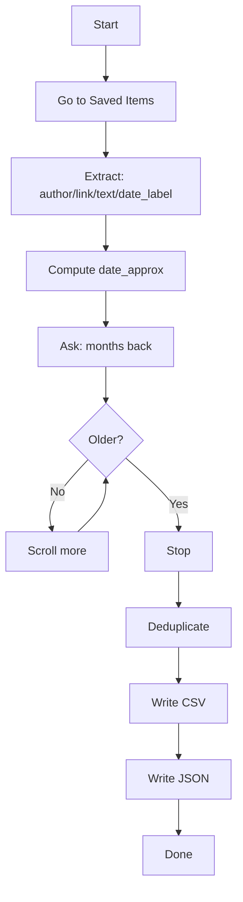

##  Export your LinkedIn saved posts with Selenium and Beautiful Soup


We save things “to read later” and… rarely return. LinkedIn’s **Saved items** helps, but curation inside the app can get messy. This walkthrough shows how to open your account, visit **Saved items**, scroll the page, extract **author, link, text, and date**, and export everything to **CSV** and **JSON** and your reading list becomes searchable and shareable data.


```
(same thing happens with ‘save to read latter’)
```
## What it does




## Assumptions and guardrails

- LinkedIn UI language is **English** (relative labels: `mo` for month, `yr` for year).
- CSV uses **UTF-8 with BOM** so Excel opens emojis and accents correctly.
- The script tries several [DOM patterns](https://developer.mozilla.org/pt-BR/docs/conflicting/Web/API/Document_Object_Model_a0b90593de4c5cb214690e823be115a18d605d4bc7719ba296e212da2abe18ef) to extract text/author across different post layouts.
- The platform forbids scraping and automated activity that abuses the service and this walkthrough is for personal archiving of your own Saved Items list with a human logging in (one of the reasons why im using an ""manual"" mode for login and consent flows).
- I suggest you to keep **2FA enabled** on your LinkedIn account. 
- Expect selectors to change over time.

## Installation and files

You need recent **Python 3** and these packages:

```sh
pip install selenium beautifulsoup4 pandas
```
- Everything (script, requirements, notes) lives in this folder:  
- [**`_resources/2024-10-17-export_linkedin_saved_posts_selenium_bs4`**](https://github.com/mrncstt/mrncstt.github.io/tree/main/_resources/2024-10-17-export_linkedin_saved_posts_selenium_bs4)
- Selenium Manager usually auto-installs the correct browser driver.  
- Editor used: **VS Code**.

  
## Output schema

| column         | meaning                                                                 |
|----------------|-------------------------------------------------------------------------|
| `author`       | Display name of the post author                                         |
| `link`         | Canonical link to the post                                              |
| `text`         | Main text that follows the post                    |
| `date_label`   | Relative UI label (e.g., `2mo`, `1yr`, `3w`)                            |
| `date_approx`  | Approximate absolute date computed from `date_label`                    |
| `extracted_on` | Date you ran the export                                                 |


## What now?
With the CSV/JSON you choose your next step, the foundation is already laid and rest is curiosity!


### Enjoyed this post? Get new ones by email:
.
<div class="bd-subscribe my-5" role="region" aria-labelledby="bd-subscribe-title">
  <style>
    .bd-subscribe{margin:2rem 0;padding:1rem;border:1px solid;border-radius:12px;background:transparent;max-width:680px;color:inherit}
    .bd-subscribe *{box-sizing:border-box;font:inherit;color:inherit}
    .bd-subscribe h2{margin:0 0 .75rem;font-size:1.1rem;line-height:1.3}
    .bd-subscribe form{display:flex;gap:.5rem;flex-wrap:wrap;align-items:center}
    .bd-subscribe .visually-hidden{position:absolute;width:1px;height:1px;padding:0;margin:-1px;overflow:hidden;clip:rect(0 0 0 0);white-space:nowrap;border:0}
    .bd-subscribe input[type="email"]{flex:1 1 260px;padding:.6rem .75rem;border:1px solid;border-radius:8px;background:transparent}
    .bd-subscribe input[type="email"]::placeholder{opacity:.65}
    .bd-subscribe input[type="submit"]{padding:.6rem .9rem;border:1px solid;border-radius:8px;background:transparent;cursor:pointer}
    .bd-subscribe p{margin:.5rem 0 0;font-size:.875rem;opacity:.85}
    @media (prefers-color-scheme:light){
      .bd-subscribe{border-color:rgba(0,0,0,.15)}
      .bd-subscribe input[type="email"],.bd-subscribe input[type="submit"]{border-color:rgba(0,0,0,.2)}
    }
    @media (prefers-color-scheme:dark){
      .bd-subscribe{border-color:rgba(255,255,255,.2)}
      .bd-subscribe input[type="email"],.bd-subscribe input[type="submit"]{border-color:rgba(255,255,255,.25)}
    }
  </style>

  <h2 id="bd-subscribe-title">Get new posts by email</h2>

  <form
    action="https://buttondown.com/api/emails/embed-subscribe/notasdaedicao"
    method="post"
    target="popupwindow"
    onsubmit="window.open('https://buttondown.com/notasdaedicao', 'popupwindow')"
    class="embeddable-buttondown-form"
    autocomplete="on"
  >
    <label for="bd-email" class="visually-hidden">Your email</label>
    <input
      type="email"
      name="email"
      id="bd-email"
      placeholder="you@example.com"
      inputmode="email"
      autocomplete="email"
      required
      aria-describedby="bd-subscribe-help"
    />
    <input type="submit" value="Subscribe" />
    <p id="bd-subscribe-help">No spam. Unsubscribe anytime.</p>
  </form>

  <noscript>
    <p>JavaScript is disabled. <a href="https://buttondown.com/notasdaedicao" target="_blank" rel="noopener">Subscribe on Buttondown</a>.</p>
  </noscript>

  <p style="margin-top:.25rem">
    <a href="https://buttondown.com/refer/notasdaedicao" target="_blank" rel="noopener">Powered by Buttondown</a>
  </p>
</div>


