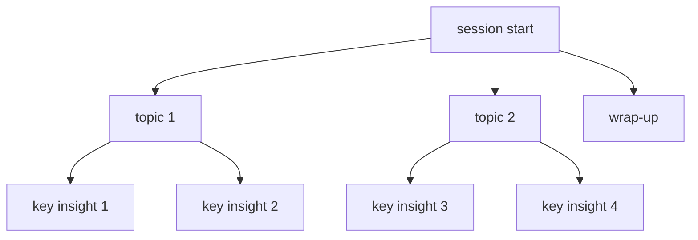

<div data-lang="en">

## Why record mentorship calls?

I recently joined an online mentorship on [Topmate](https://topmate.io/). After the call, Topmate emailed me a link to the MP4 recording. Having the full session lets me revisit the advice, catch the bits I missed live, and turn a dense hour into working notes.

</div>
<div data-lang="pt">

## Por que gravar chamadas de mentoria?

Recentemente participei de uma mentoria online no [Topmate](https://topmate.io/). Depois da chamada, o Topmate me enviou um link para a gravacao em MP4. Ter a sessao completa me permite revisitar os conselhos, captar os detalhes que perdi ao vivo e transformar uma hora densa em anotações uteis.

</div>
<div data-lang="es">

## Por que grabar las llamadas de mentoria?

Hace poco participe en una mentoria online en [Topmate](https://topmate.io/). Despues de la llamada, Topmate me envio un enlace a la grabacion en MP4. Tener la sesion completa me permite revisar los consejos, captar lo que se me escapo en directo y convertir una hora densa en apuntes de trabajo.

</div>

<div class="figure-block">


<div class="figure-caption"><strong>Fig 1.</strong> Mentorship recording workflow diagram from call to insights.</div>
</div>

<div data-lang="en">

> Quick note on etiquette: make sure everyone on the call knows it's being recorded.

## From MP4 to MP3

To simplify transcription, I pull down the video and extract the audio. This version streams the download (safer for large files) and uses MoviePy to write an MP3.

</div>
<div data-lang="pt">

> Nota rapida sobre etiqueta: certifique-se de que todos na chamada sabem que esta sendo gravada.

## De MP4 para MP3

Para simplificar a transcricao, baixo o video e extraio o audio. Esta versao faz o download em streaming (mais seguro para arquivos grandes) e usa o MoviePy para gerar o MP3.

</div>
<div data-lang="es">

> Nota rapida sobre protocolo: asegurate de que todos en la llamada saben que se esta grabando.

## De MP4 a MP3

Para simplificar la transcripcion, descargo el video y extraigo el audio. Esta version hace la descarga en streaming (mas seguro para archivos grandes) y usa MoviePy para generar el MP3.

</div>

```python
import requests
from moviepy.editor import VideoFileClip

def download_video(url: str, output_path: str) -> None:
    with requests.get(url, stream=True) as r:
        r.raise_for_status()
        with open(output_path, "wb") as f:
            for chunk in r.iter_content(chunk_size=8192):
                if chunk:
                    f.write(chunk)

def convert_mp4_to_mp3(mp4_file: str, mp3_file: str) -> None:
    with VideoFileClip(mp4_file) as clip:
        clip.audio.write_audiofile(mp3_file)

# usage
video_url = "https://topmate-call-recordings.s3.ap-south-1.amazonaws.com/recording_recording_123456-imagine-like-a-guid.mp4"
mp4_file = "mentorship.mp4"
mp3_file = "mentorship.mp3"

download_video(video_url, mp4_file)
convert_mp4_to_mp3(mp4_file, mp3_file)
```

<div data-lang="en">

> For best accuracy with Speech-to-Text, FLAC or LINEAR16 usually beats MP3. I kept MP3 here to match the original workflow.

## Transcribing with Google Cloud Speech-to-Text

Setup (once):

- Create a GCP project and enable the **Speech-to-Text API**
- Upload `mentorship.mp3` to **Google Cloud Storage**
- Set `GOOGLE_APPLICATION_CREDENTIALS` to your service account JSON

Here's a minimal long-audio transcription (31-minute files need the long-running API). I also enabled punctuation and confidence scores.

</div>
<div data-lang="pt">

> Para melhor precisao com o Speech-to-Text, FLAC ou LINEAR16 costumam superar o MP3. Mantive MP3 aqui para seguir o fluxo original.

## Transcrevendo com o Google Cloud Speech-to-Text

Configuracao (uma vez):

- Crie um projeto no GCP e ative a **Speech-to-Text API**
- Faca upload de `mentorship.mp3` para o **Google Cloud Storage**
- Configure `GOOGLE_APPLICATION_CREDENTIALS` com o JSON da sua conta de servico

Aqui esta uma transcricao minima de audio longo (arquivos de 31 minutos precisam da API long-running). Tambem habilitei pontuacao automatica e scores de confianca.

</div>
<div data-lang="es">

> Para mayor precision con Speech-to-Text, FLAC o LINEAR16 suelen superar al MP3. Mantuve MP3 aqui para seguir el flujo original.

## Transcribiendo con Google Cloud Speech-to-Text

Configuracion (una sola vez):

- Crea un proyecto en GCP y activa la **Speech-to-Text API**
- Sube `mentorship.mp3` a **Google Cloud Storage**
- Configura `GOOGLE_APPLICATION_CREDENTIALS` con el JSON de tu cuenta de servicio

Aqui va una transcripcion minima de audio largo (archivos de 31 minutos necesitan la API long-running). Tambien active la puntuacion automatica y los scores de confianza.

</div>

```python
from google.cloud import speech_v1p1beta1 as speech

def transcribe_gcs(gcs_uri: str, output_path: str) -> None:
    client = speech.SpeechClient()

    audio = speech.RecognitionAudio(uri=gcs_uri)
    config = speech.RecognitionConfig(
        encoding=speech.RecognitionConfig.AudioEncoding.MP3,
        sample_rate_hertz=44100,         # match your file
        language_code="en-US",
        model="long",
        audio_channel_count=2,
        enable_automatic_punctuation=True,
        enable_word_confidence=True,
        # optional diarization (speakers):
        # enable_speaker_diarization=True,
        # diarization_speaker_count=2,
    )

    operation = client.long_running_recognize(config=config, audio=audio)
    response = operation.result(timeout=3600)

    with open(output_path, "w", encoding="utf-8") as f:
        for result in response.results:
            f.write(result.alternatives[0].transcript + "\n")

# run
gcs_uri = "gs://bucket-name/mentorship.mp3"
transcribe_gcs(gcs_uri, "audio.txt")
```

<div data-lang="en">

My run (for context):

- Audio: MP3, 44,100 Hz, 2 channels
- Billed audio time: 31:57
- Transcription time: ~11:43
- Automatic punctuation + word confidence on
- Model: `long` (API `v1p1beta1`)

</div>
<div data-lang="pt">

Minha execução (para contexto):

- Audio: MP3, 44.100 Hz, 2 canais
- Tempo de audio cobrado: 31:57
- Tempo de transcricao: ~11:43
- Pontuacao automatica + confianca por palavra ativados
- Modelo: `long` (API `v1p1beta1`)

</div>
<div data-lang="es">

Mi ejecucion (para contexto):

- Audio: MP3, 44.100 Hz, 2 canales
- Tiempo de audio facturado: 31:57
- Tiempo de transcripcion: ~11:43
- Puntuacion automatica + confianza por palabra activados
- Modelo: `long` (API `v1p1beta1`)

</div>

<div class="figure-block">


<div class="figure-caption"><strong>Fig 2.</strong> Google Cloud Speech-to-Text transcription result output.</div>
</div>

<div data-lang="en">

Example raw line:

</div>
<div data-lang="pt">

Exemplo de linha bruta:

</div>
<div data-lang="es">

Ejemplo de linea sin procesar:

</div>

```
if you... good afternoon, I don't know where exactly you are based on but ...
```

<div data-lang="en">

## Asking ChatGPT for the good stuff

Once I have `audio.txt`, I pass the transcript to a prompt that asks for a short summary, key decisions, and action items. For long transcripts, chunk first (tokens are a thing), then merge the summaries.

</div>
<div data-lang="pt">

## Pedindo ao ChatGPT o que interessa

Com o `audio.txt` em maos, passo a transcricao para um prompt que pede um resumo curto, decisoes-chave e proximos passos. Para transcricoes longas, divida primeiro (tokens sao limitados) e depois junte os resumos.

</div>
<div data-lang="es">

## Pidiendole a ChatGPT lo importante

Con el `audio.txt` en mano, paso la transcripcion a un prompt que pide un resumen breve, decisiones clave y proximos pasos. Para transcripciones largas, divide primero (los tokens tienen limite) y luego combina los resumenes.

</div>

```python
def get_chatgpt_insights(prompt: str) -> str:
    """
    placeholder for your chatgpt call.
    recommend: split transcript into ~2–3k word chunks,
    ask for structured bullets (summary / decisions / actions),
    then ask for a final synthesis across chunks.
    """
    ...

with open("audio.txt", "r", encoding="utf-8") as f:
    transcript = f.read()

prompt = (
    "you are extracting practical insights from a mentorship transcript.\n\n"
    "return three sections:\n"
    "1) summary (5 bullets max)\n"
    "2) decisions agreed (bulleted)\n"
    "3) next actions (who/what/when)\n\n"
    f"transcript:\n{transcript}\n"
)

insights = get_chatgpt_insights(prompt)
print(insights)
```

<div data-lang="en">

## A tiny diagram with Mermaid

Visuals make sprawling conversations easier to digest. Here's a compact Mermaid map you can tweak to your session:

</div>
<div data-lang="pt">

## Um pequeno diagrama com Mermaid

Visualizacoes tornam conversas longas mais faceis de digerir. Aqui vai um mapa Mermaid compacto que você pode adaptar a sua sessao:

</div>
<div data-lang="es">

## Un pequeno diagrama con Mermaid

Las visualizaciones hacen que las conversaciones extensas sean mas faciles de digerir. Aqui va un mapa Mermaid compacto que puedes adaptar a tu sesion:

</div>



---

<div data-lang="en">

This workflow turned a one-off call into reusable notes and clear next steps. If you're experimenting, the two dials that matter most are **audio encoding** (FLAC/LINEAR16 if you can) and **diarization** (when multiple voices overlap), tuning those pays off quickly.

</div>
<div data-lang="pt">

Esse fluxo transformou uma chamada avulsa em anotações reutilizaveis e proximos passos claros. Se você esta experimentando, os dois ajustes que mais importam sao a **codificacao do audio** (FLAC/LINEAR16 se possível) e a **diarizacao** (quando varias vozes se sobrepoem) -- ajustar esses dois da retorno rapido.

</div>
<div data-lang="es">

Este flujo convirtio una llamada puntual en apuntes reutilizables y proximos pasos claros. Si estas experimentando, los dos ajustes que mas importan son la **codificacion del audio** (FLAC/LINEAR16 si puedes) y la **diarizacion** (cuando varias vocês se solapan) -- afinar esos dos da resultados rapido.

</div>

## Links

- [Topmate](https://topmate.io/)
