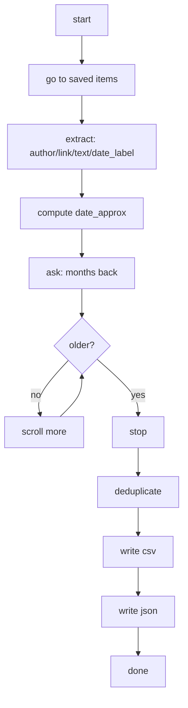

<div data-lang="en">

We save things "to read later" and... rarely return. LinkedIn's **saved items** helps, but curation inside the app can get messy. This walkthrough shows how to open your account, visit **saved items**, scroll the page, extract **author, link, text, and date**, and export everything to **CSV** and **JSON** and your reading list becomes searchable and shareable data.

</div>
<div data-lang="pt">

Salvamos coisas "para ler depois" e... raramente voltamos. Os **itens salvos** do LinkedIn ajudam, mas curadoria dentro do app pode ficar bagunçada. Este passo a passo mostra como acessar sua conta, visitar os **itens salvos**, rolar a página, extrair **autor, link, texto e data** e exportar tudo para **CSV** e **JSON** -- sua lista de leitura se torna dados pesquisáveis e compartilháveis.

</div>
<div data-lang="es">

Guardamos cosas "para leer luego" y... rara vez volvemos. Los **elementos guardados** de LinkedIn ayudan, pero organizar dentro de la app puede volverse un caos. Esta guía muestra cómo acceder a tu cuenta, visitar los **elementos guardados**, hacer scroll en la página, extraer **autor, enlace, texto y fecha** y exportar todo a **CSV** y **JSON** -- tu lista de lectura se convierte en datos buscables y compartibles.

</div>

<div class="figure-block">


<div class="figure-caption"><strong>Fig 1.</strong> Meme about saving things to read later and never returning.</div>
</div>

```
(same thing happens with 'save to read later')
```

<div data-lang="en">

## What it does

</div>
<div data-lang="pt">

## O que faz

</div>
<div data-lang="es">

## Qué hace

</div>



<div data-lang="en">

## Assumptions and guardrails

- LinkedIn UI language is **English** (relative labels: `mo` for month, `yr` for year).
- CSV uses **UTF-8 with BOM** so Excel opens emojis and accents correctly.
- The script tries several [DOM patterns](https://developer.mozilla.org/pt-br/docs/conflicting/web/api/document_object_model_a0b90593de4c5cb214690e823be115a18d605d4bc7719ba296e212da2abe18ef) to extract text/author across different post layouts.
- The platform forbids scraping and automated activity that abuses the service and this walkthrough is for personal archiving of your own saved items list with a human logging in (one of the reasons why I'm using a "manual" mode for login and consent flows).
- I suggest keeping **2FA enabled** on your LinkedIn account.
- Expect selectors to change over time.

</div>
<div data-lang="pt">

## Premissas e salvaguardas

- O idioma da interface do LinkedIn deve ser **inglês** (labels relativos: `mo` para mês, `yr` para ano).
- O CSV usa **UTF-8 com BOM** para que o Excel abra emojis e acentos corretamente.
- O script tenta vários [padrões de DOM](https://developer.mozilla.org/pt-br/docs/conflicting/web/api/document_object_model_a0b90593de4c5cb214690e823be115a18d605d4bc7719ba296e212da2abe18ef) para extrair texto/autor em diferentes layouts de posts.
- A plataforma proibe scraping e atividade automatizada que abuse do serviço -- este passo a passo é para arquivamento pessoal da sua própria lista de itens salvos, com login humano (um dos motivos de usar o modo "manual" para login e fluxos de consentimento).
- Sugiro manter o **2FA ativado** na sua conta do LinkedIn.
- Espere que seletores mudem com o tempo.

</div>
<div data-lang="es">

## Supuestos y precauciones

- El idioma de la interfaz de LinkedIn debe ser **inglés** (etiquetas relativas: `mo` para mes, `yr` para año).
- El CSV usa **UTF-8 con BOM** para que Excel abra emojis y acentos correctamente.
- El script prueba varios [patrones de DOM](https://developer.mozilla.org/pt-br/docs/conflicting/web/api/document_object_model_a0b90593de4c5cb214690e823be115a18d605d4bc7719ba296e212da2abe18ef) para extraer texto/autor en distintos layouts de posts.
- La plataforma prohíbe el scraping y la actividad automatizada que abuse del servicio -- esta guía es para archivar personalmente tu propia lista de elementos guardados, con login humano (una de las razones por las que uso el modo "manual" para login y flujos de consentimiento).
- Te recomiendo mantener el **2FA activado** en tu cuenta de LinkedIn.
- Los selectores pueden cambiar con el tiempo.

</div>

<div data-lang="en">

## Installation and files

You need recent **Python 3** and these packages:

</div>
<div data-lang="pt">

## Instalação e arquivos

Você precisa de **Python 3** recente e destes pacotes:

</div>
<div data-lang="es">

## Instalación y archivos

Necesitas **Python 3** reciente y estos paquetes:

</div>

```sh
pip install selenium beautifulsoup4 pandas
```

<div data-lang="en">

- Everything (script, requirements, notes, installation) lives in this folder:
- [Click here](https://github.com/mrncstt/mrncstt.github.io/tree/main/_resources/resources_2024-10-17-export_linkedin_saved_posts_selenium_bs4)
- Selenium Manager usually auto-installs the correct browser driver.
- Editor used: **VS Code**.

</div>
<div data-lang="pt">

- Tudo (script, requirements, notas, instalação) está nesta pasta:
- [Clique aqui](https://github.com/mrncstt/mrncstt.github.io/tree/main/_resources/resources_2024-10-17-export_linkedin_saved_posts_selenium_bs4)
- O Selenium Manager geralmente instala automaticamente o driver do navegador correto.
- Editor utilizado: **VS Code**.

</div>
<div data-lang="es">

- Todo (script, requirements, notas, instalación) está en esta carpeta:
- [Haz clic aquí](https://github.com/mrncstt/mrncstt.github.io/tree/main/_resources/resources_2024-10-17-export_linkedin_saved_posts_selenium_bs4)
- Selenium Manager normalmente instala automáticamente el driver del navegador correcto.
- Editor utilizado: **VS Code**.

</div>

<div data-lang="en">

## Output schema

</div>
<div data-lang="pt">

## Esquema de saída

</div>
<div data-lang="es">

## Esquema de salida

</div>

| Column         | Meaning                                                                 |
|----------------|-------------------------------------------------------------------------|
| `author`       | Display name of the post author                                         |
| `link`         | Canonical link to the post                                              |
| `text`         | Main text that follows the post                    |
| `date_label`   | Relative UI label (e.g., `2mo`, `1yr`, `3w`)                            |
| `date_approx`  | Approximate absolute date computed from `date_label`                    |
| `extracted_on` | Date you ran the export                                                 |

<div data-lang="en">

## What now?

With the CSV/JSON you choose your next step, the foundation is already laid and rest is curiosity!

</div>
<div data-lang="pt">

## E agora?

Com o CSV/JSON você escolhe o próximo passo -- a base já está pronta e o resto é curiosidade!

</div>
<div data-lang="es">

## ¿Y ahora qué?

Con el CSV/JSON eliges tu próximo paso -- la base ya está puesta y lo demás es curiosidad!

</div>

## Links

- [Script and resources](https://github.com/mrncstt/mrncstt.github.io/tree/main/_resources/resources_2024-10-17-export_linkedin_saved_posts_selenium_bs4)
- [DOM patterns (MDN)](https://developer.mozilla.org/pt-br/docs/conflicting/web/api/document_object_model_a0b90593de4c5cb214690e823be115a18d605d4bc7719ba296e212da2abe18ef)
