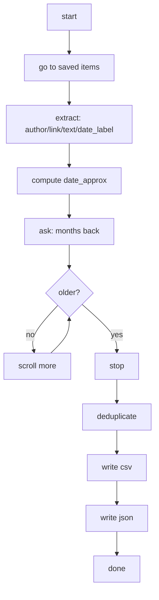

We save things "to read later" and… rarely return. LinkedIn's **saved items** helps, but curation inside the app can get messy. This walkthrough shows how to open your account, visit **saved items**, scroll the page, extract **author, link, text, and date**, and export everything to **CSV** and **JSON** and your reading list becomes searchable and shareable data.


<div class="figure-block">


<div class="figure-caption"><strong>Fig 1.</strong> Meme about saving things to read later and never returning.</div>
</div>
```
(same thing happens with 'save to read latter')
```
## What it does




## Assumptions and guardrails

- LinkedIn UI language is **English** (relative labels: `mo` for month, `yr` for year).
- CSV uses **UTF-8 with BOM** so Excel opens emojis and accents correctly.
- The script tries several [DOM patterns](https://developer.mozilla.org/pt-br/docs/conflicting/web/api/document_object_model_a0b90593de4c5cb214690e823be115a18d605d4bc7719ba296e212da2abe18ef) to extract text/author across different post layouts.
- The platform forbids scraping and automated activity that abuses the service and this walkthrough is for personal archiving of your own saved items list with a human logging in (one of the reasons why I'm using a "manual" mode for login and consent flows).
- I suggest you to keep **2FA enabled** on your LinkedIn account.
- Expect selectors to change over time.

## Installation and files

You need recent **Python 3** and these packages:

```sh
pip install selenium beautifulsoup4 pandas
```
- Everything (script, requirements, notes, installation) lives in this folder:
- [Click here](https://github.com/mrncstt/mrncstt.github.io/tree/main/_resources/resources_2024-10-17-export_linkedin_saved_posts_selenium_bs4)
- Selenium Manager usually auto-installs the correct browser driver.
- Editor used: **VS Code**.


## Output schema

| Column         | Meaning                                                                 |
|----------------|-------------------------------------------------------------------------|
| `author`       | Display name of the post author                                         |
| `link`         | Canonical link to the post                                              |
| `text`         | Main text that follows the post                    |
| `date_label`   | Relative UI label (e.g., `2mo`, `1yr`, `3w`)                            |
| `date_approx`  | Approximate absolute date computed from `date_label`                    |
| `extracted_on` | Date you ran the export                                                 |


## What now?
With the CSV/JSON you choose your next step, the foundation is already laid and rest is curiosity!

## Links

- [Script and resources](https://github.com/mrncstt/mrncstt.github.io/tree/main/_resources/resources_2024-10-17-export_linkedin_saved_posts_selenium_bs4)
- [DOM patterns (MDN)](https://developer.mozilla.org/pt-br/docs/conflicting/web/api/document_object_model_a0b90593de4c5cb214690e823be115a18d605d4bc7719ba296e212da2abe18ef)
