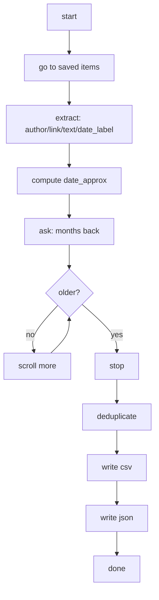

<div data-lang="en">

We save a ton of stuff "to read later" and almost never come back, and LinkedIn's saved items help a bit, but the curation inside the app turns into a mess fast, so I built a walkthrough that logs into the account, opens the saved items, scrolls the page, pulls author, link, text and date and dumps it all into a CSV and a JSON, turning that reading list into searchable, shareable data

## What it does

</div>

<div data-lang="pt">

A gente salva um monte de coisa "pra ler depois" e quase nunca volta e os itens salvos do LinkedIn até ajudam, mas a curadoria dentro do app vira uma bagunça rápido, então fiz um passo a passo que entra na conta, abre os salvos, rola a página, extrai autor, link, texto e data e joga tudo num CSV e num JSON, transformando aquela lista de leitura em dado pesquisável e compartilhável

## O que faz

</div>

<div data-lang="es">

Uno guarda un montón de cosas "para leer después" y casi nunca vuelve y los guardados de LinkedIn ayudan, pero la curaduría dentro de la app se vuelve un desastre rápido, así que armé un paso a paso que entra a la cuenta, abre los guardados, scrollea la página, extrae autor, link, texto y fecha y vuelca todo en un CSV y un JSON, convirtiendo esa lista de lectura en datos buscables y compartibles

## Qué hace

</div>

<div class="figure-block">


<div class="figure-caption"><strong>Fig 1.</strong> Meme about saving things to read later and never returning.</div>
</div>



<div data-lang="en">

## Assumptions

LinkedIn's interface language needs to be in English because the labels are relative, mo for month and yr for year, and the CSV comes out in UTF-8 with BOM so Excel opens emoji and accents right, and the script tries several DOM patterns to handle pulling text and author across different post layouts

The platform forbids scraping and automated activity that abuses the service, so this walkthrough is only for archiving your own list of saved items, with a human login, which is one of the reasons for using manual mode for login and consent flows, and I suggest keeping 2FA on for your LinkedIn account and counting on selectors changing over time

## Setup

You need a recent Python 3 and these packages:

</div>

<div data-lang="pt">

## Premissas

O idioma da interface do LinkedIn precisa estar em inglês porque os labels são relativos, mo pra mês e yr pra ano, e o CSV sai em UTF-8 com BOM pra que o Excel abra emoji e acento direito, e o script tenta vários padrões de DOM pra dar conta de extrair texto e autor em layouts de post diferentes

A plataforma proíbe scraping e atividade automatizada que abuse do serviço, então esse passo a passo é só pra arquivar a sua própria lista de salvos, com login humano, que é um dos motivos de usar o modo manual pro login e pros fluxos de consentimento, e eu sugiro manter o 2FA ligado na sua conta do LinkedIn e já contar que seletor muda com o tempo

## Instalação

Você precisa de um Python 3 recente e desses pacotes:

</div>

<div data-lang="es">

## Premisas

El idioma de la interfaz de LinkedIn tiene que estar en inglés porque los labels son relativos, mo para mes y yr para año, y el CSV sale en UTF-8 con BOM para que el Excel abra emoji y acento bien, y el script prueba varios patrones de DOM para poder extraer texto y autor en layouts de post distintos

La plataforma prohíbe el scraping y la actividad automatizada que abuse del servicio, así que este paso a paso es solo para archivar tu propia lista de guardados, con login humano, que es uno de los motivos de usar el modo manual para el login y los flujos de consentimiento, y sugiero mantener el 2FA prendido en tu cuenta de LinkedIn y ya contar con que los selectores cambian con el tiempo

## Instalación

Necesitás un Python 3 reciente y estos paquetes:

</div>

```
pip install selenium beautifulsoup4 pandas
```

<div data-lang="en">

Everything, script, requirements, notes and setup, is in that folder, just click, and Selenium Manager usually installs the right browser driver on its own, and the editor I used was VS Code

## Output

</div>

<div data-lang="pt">

Tudo, script, requirements, notas e instalação, tá nessa pasta, é só clicar, e o Selenium Manager normalmente já instala o driver certo do navegador sozinho, e o editor que usei foi o VS Code

## Esquema

</div>

<div data-lang="es">

Todo, script, requirements, notas e instalación, está en esa carpeta, solo hacé clic, y el Selenium Manager normalmente ya instala el driver correcto del navegador solo, y el editor que usé fue VS Code

## Esquema

</div>

| Column | Meaning |
|---|---|
| author | Display name of the post author |
| link | Canonical link to the post |
| text | Main text that follows the post |
| date_label | Relative UI label (e.g., 2mo, 1yr, 3w) |
| date_approx | Approximate absolute date computed from date_label |
| extracted_on | Date you ran the export |

<div data-lang="en">

## What now?

With the CSV and the JSON in hand you pick the next step, the base is ready and the rest is curiosity

## Links

- [Script and resources](https://github.com/mrncstt)
- [DOM patterns (MDN)](https://developer.mozilla.org/en-US/docs/Web/API/Document_Object_Model)

</div>

<div data-lang="pt">

## E agora?

Com o CSV e o JSON na mão você escolhe o próximo passo, a base já tá pronta e o resto é curiosidade

## Links

- [Script and resources](https://github.com/mrncstt)
- [DOM patterns (MDN)](https://developer.mozilla.org/en-US/docs/Web/API/Document_Object_Model)

</div>

<div data-lang="es">

## ¿Y ahora?

Con el CSV y el JSON en la mano elegís el próximo paso, la base ya está lista y el resto es curiosidad

## Links

- [Script and resources](https://github.com/mrncstt)
- [DOM patterns (MDN)](https://developer.mozilla.org/en-US/docs/Web/API/Document_Object_Model)

</div>
