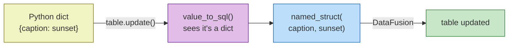

<div data-lang="en">

## How I found the project

I was reading about newer data formats when I came across [LanceDB](https://lancedb.com/). It stores text, images, videos, embeddings, and structured data together in one place. Went through their GitHub issues, filtered by `good first issue`, found one that looked doable.

</div>
<div data-lang="pt">

## Como encontrei o projeto

Eu estava lendo sobre formatos de dados mais recentes quando encontrei o [LanceDB](https://lancedb.com/). Ele armazena texto, imagens, videos, embeddings e dados estruturados juntos em um so lugar. Passei pelos issues do GitHub, filtrei por `good first issue` e encontrei um que parecia viavel.

</div>
<div data-lang="es">

## Como encontre el proyecto

Estaba leyendo sobre formatos de datos mas recientes cuando encontre [LanceDB](https://lancedb.com/). Almacena texto, imagenes, videos, embeddings y datos estructurados juntos en un solo lugar. Revise los issues de GitHub, filtre por `good first issue` y encontre uno que parecia viable.

</div>

<div data-lang="en">

## The issue

[This one](https://github.com/lancedb/lancedb/issues/1363). `table.update()` couldn't handle struct columns if you passed a Python dict.

Say you have a training data pipeline that stores thousands of image annotations like this:

</div>
<div data-lang="pt">

## O issue

[Este aqui](https://github.com/lancedb/lancedb/issues/1363). O `table.update()` nao conseguia lidar com colunas struct se você passasse um dict Python.

Digamos que você tem um pipeline de dados de treinamento que armazena milhares de anotações de imagens assim:

</div>
<div data-lang="es">

## El issue

[Este](https://github.com/lancedb/lancedb/issues/1363). `table.update()` no podia manejar columnas struct si pasabas un dict de Python.

Supongamos que tienes un pipeline de datos de entrenamiento que almacena miles de anotaciones de imagenes asi:

</div>

```json
[
    {
        "sample_id": "img_991204",
        "dataset": "laion-aesthetic",
        "annotation": {
            "caption": "sunset over mountains",
            "aesthetic_score": 7.2,
            "watermarked": false,
            "source": "flickr"
        }
    },
    {
        "sample_id": "img_991205",
        "dataset": "laion-aesthetic",
        "annotation": {
            "caption": "cat on a couch",
            "aesthetic_score": 6.8,
            "watermarked": true,
            "source": "unsplash"
        }
    },
    {
        "sample_id": "img_991206",
        "dataset": "laion-aesthetic",
        "annotation": {
            "caption": "street art mural",
            "aesthetic_score": 5.1,
            "watermarked": false,
            "source": "flickr"
        }
    }
]
```

<div data-lang="en">

You ingest those into LanceDB. Later you find out a batch came with wrong `aesthetic_score` values because the scoring model was generating bad numbers. You need to update specific rows. You'd expect this to work:

</div>
<div data-lang="pt">

Voce ingere esses dados no LanceDB. Depois descobre que um lote veio com valores de `aesthetic_score` errados porque o modelo de pontuacao estava gerando numeros ruins. Voce precisa atualizar linhas especificas. Voce esperaria que isso funcionasse:

</div>
<div data-lang="es">

Ingieres esos datos en LanceDB. Mas tarde descubres que un lote llego con valores de `aesthetic_score` incorrectos porque el modelo de puntuacion estaba generando numeros erroneos. Necesitas actualizar filas especificas. Esperarias que esto funcionase:

</div>

```python
table.update(
    where="sample_id = 'img_991204'",
    values={
        "annotation": {
            "caption": "sunset over mountains",
            "aesthetic_score": 8.1,
            "watermarked": False,
            "source": "flickr"
        }
    }
)
# expected: annotation updated with aesthetic_score = 8.1
# actual: NotImplementedError
```

<div data-lang="en">

Nope. LanceDB didn't know how to turn a dict into SQL. The `values` parameter only worked with scalar types.

You could get around it with `values_sql`, writing the SQL yourself:

</div>
<div data-lang="pt">

Nao. O LanceDB nao sabia como transformar um dict em SQL. O parametro `values` so funcionava com tipos escalares.

Voce podia contornar isso com `values_sql`, escrevendo o SQL manualmente:

</div>
<div data-lang="es">

No. LanceDB no sabia como convertir un dict en SQL. El parametro `values` solo funcionaba con tipos escalares.

Podias solucionarlo con `values_sql`, escribiendo el SQL manualmente:

</div>

```python
table.update(
    where="sample_id = 'img_991204'",
    values_sql={
        "annotation": "named_struct('caption', 'sunset over mountains', "
                      "'aesthetic_score', 8.1, 'watermarked', FALSE, "
                      "'source', 'flickr')"
    }
)
```

<div data-lang="en">

It works, but you're writing raw SQL strings by hand. Quotes, commas, nested structs. Gets ugly fast.

The [issue](https://github.com/lancedb/lancedb/issues/1363) pointed to `named_struct` from DataFusion as the way to solve this.

</div>
<div data-lang="pt">

Funciona, mas você esta escrevendo strings SQL na mao. Aspas, virgulas, structs aninhados. Fica feio rapido.

O [issue](https://github.com/lancedb/lancedb/issues/1363) apontava para `named_struct` do DataFusion como a solução.

</div>
<div data-lang="es">

Funciona, pero estas escribiendo cadenas SQL a mano. Comillas, comas, structs anidados. Se pone feo rapido.

El [issue](https://github.com/lancedb/lancedb/issues/1363) senalaba `named_struct` de DataFusion como la solucion.

</div>

<div data-lang="en">

## Background

### DataFusion and `named_struct`

[Apache DataFusion](https://datafusion.apache.org/) is the SQL engine behind LanceDB. When you call `table.update()`, your Python values get converted to SQL strings, and DataFusion runs them. Nobody had written the part that converts dicts.

The issue mentioned `named_struct` but I didn't know where that function came from. That led me to find out that LanceDB [uses DataFusion to run SQL queries](https://docs.lancedb.com/search/sql/). I had to read through the existing code and the DataFusion docs before it clicked.

`named_struct` is a SQL function that creates structs with named fields. You pass alternating name-value pairs:

</div>
<div data-lang="pt">

## Contexto

### DataFusion e `named_struct`

[Apache DataFusion](https://datafusion.apache.org/) e o motor SQL por tras do LanceDB. Quando você chama `table.update()`, seus valores Python sao convertidos em strings SQL e o DataFusion os executa. Ninguem tinha escrito a parte que converte dicts.

O issue mencionava `named_struct` mas eu nao sabia de onde vinha essa função. Isso me levou a descobrir que o LanceDB [usa DataFusion para executar queries SQL](https://docs.lancedb.com/search/sql/). Tive que ler o código existente e a documentação do DataFusion antes de entender.

`named_struct` e uma função SQL que cria structs com campos nomeados. Voce passa pares alternados de nome-valor:

</div>
<div data-lang="es">

## Contexto

### DataFusion y `named_struct`

[Apache DataFusion](https://datafusion.apache.org/) es el motor SQL detras de LanceDB. Cuando llamas a `table.update()`, tus valores Python se convierten en cadenas SQL y DataFusion las ejecuta. Nadie habia escrito la parte que convierte dicts.

El issue mencionaba `named_struct` pero yo no sabia de donde venia esa funcion. Eso me llevo a descubrir que LanceDB [usa DataFusion para ejecutar queries SQL](https://docs.lancedb.com/search/sql/). Tuve que leer el código existente y la documentacion de DataFusion antes de entenderlo.

`named_struct` es una funcion SQL que crea structs con campos nombrados. Pasas pares alternados de nombre-valor:

</div>

```sql
SELECT named_struct(
    'caption', 'sunset over mountains',
    'aesthetic_score', 8.1,
    'watermarked', FALSE,
    'source', 'flickr'
);
-- {"caption": "sunset over mountains",
--  "aesthetic_score": 8.1,
--  "watermarked": false,
--  "source": "flickr"}
```

<div data-lang="en">

By the time I picked up the issue, `named_struct` was already available in LanceDB's version of DataFusion.

### [`singledispatch`](https://docs.python.org/3/library/functools.html#functools.singledispatch)

The issue already said to use [`singledispatch`](https://docs.python.org/3/library/functools.html#functools.singledispatch) from `functools`. It lets you register a different function for each type. So instead of a long chain of `if isinstance(value, str) ... elif isinstance(value, float) ...`, each type gets its own function that you can add without touching the rest.

Here's how the whole flow works:

</div>
<div data-lang="pt">

Quando peguei o issue, `named_struct` ja estava disponivel na versao do DataFusion usada pelo LanceDB.

### [`singledispatch`](https://docs.python.org/3/library/functools.html#functools.singledispatch)

O issue ja dizia para usar [`singledispatch`](https://docs.python.org/3/library/functools.html#functools.singledispatch) do `functools`. Ele permite registrar uma função diferente para cada tipo. Entao, em vez de uma cadeia longa de `if isinstance(value, str) ... elif isinstance(value, float) ...`, cada tipo tem sua propria função que você pode adicionar sem mexer no resto.

Assim funciona o fluxo completo:

</div>
<div data-lang="es">

Cuando tome el issue, `named_struct` ya estaba disponible en la version de DataFusion usada por LanceDB.

### [`singledispatch`](https://docs.python.org/3/library/functools.html#functools.singledispatch)

El issue ya decia que usara [`singledispatch`](https://docs.python.org/3/library/functools.html#functools.singledispatch) de `functools`. Permite registrar una funcion diferente para cada tipo. Asi, en lugar de una cadena larga de `if isinstance(value, str) ... elif isinstance(value, float) ...`, cada tipo tiene su propia funcion que puedes anadir sin tocar el resto.

Asi funciona el flujo completo:

</div>



<div data-lang="en">

### The existing code

`python/python/lancedb/util.py` already had `value_to_sql` using `singledispatch`. One handler per type. That's what made adding `dict` just one new function instead of rewriting the whole thing.

</div>
<div data-lang="pt">

### O código existente

`python/python/lancedb/util.py` ja tinha `value_to_sql` usando `singledispatch`. Um handler por tipo. Foi isso que fez com que adicionar `dict` fosse apenas uma nova função em vez de reescrever tudo.

</div>
<div data-lang="es">

### El código existente

`python/python/lancedb/util.py` ya tenia `value_to_sql` usando `singledispatch`. Un handler por tipo. Eso es lo que hizo que anadir `dict` fuese solo una nueva funcion en lugar de reescribir todo.

</div>

```python
@singledispatch
def value_to_sql(value):
    raise TypeError(f"Cannot convert {type(value)} to SQL")

@value_to_sql.register(str)
def _(value: str):
    value = value.replace("'", "''")
    return f"'{value}'"
# value_to_sql("sunset") -> 'sunset'
# value_to_sql("it's raining") -> 'it''s raining'

@value_to_sql.register(float)
def _(value: float):
    return str(value)
# value_to_sql(7.2) -> 7.2

@value_to_sql.register(bool)
def _(value: bool):
    return str(value).upper()
# value_to_sql(False) -> FALSE

@value_to_sql.register(list)
def _(value: list):
    return "[" + ", ".join(map(value_to_sql, value)) + "]"
# value_to_sql(["flickr", "unsplash"]) -> ['flickr', 'unsplash']

@value_to_sql.register(type(None))
def _(value):
    return "NULL"
# value_to_sql(None) -> NULL

# value_to_sql({"caption": "sunset"}) -> ??? no handler for dict
```

<div data-lang="en">

## What I added

</div>
<div data-lang="pt">

## O que eu adicionei

</div>
<div data-lang="es">

## Lo que anadi

</div>

```python
@value_to_sql.register(dict)
def _(value: dict):
    # https://datafusion.apache.org/user-guide/sql/scalar_functions.html#named-struct
    return (
        "named_struct("
        + ", ".join(f"'{k}', {value_to_sql(v)}" for k, v in value.items())
        + ")"
    )
```

<div data-lang="en">

Goes through each key-value pair, puts the key as a string literal, and calls `value_to_sql` on the value. So our `annotation` dict:

</div>
<div data-lang="pt">

Percorre cada par chave-valor, coloca a chave como string literal e chama `value_to_sql` no valor. Entao nosso dict `annotation`:

</div>
<div data-lang="es">

Recorre cada par clave-valor, pone la clave como literal de cadena y llama a `value_to_sql` sobre el valor. Asi nuestro dict `annotation`:

</div>

```python
value_to_sql({
    "caption": "sunset over mountains",
    "aesthetic_score": 8.1,
    "watermarked": False,
    "source": "flickr"
})
```

<div data-lang="en">

becomes:

</div>
<div data-lang="pt">

se torna:

</div>
<div data-lang="es">

se convierte en:

</div>

```sql
named_struct(
    'caption', 'sunset over mountains',
    'aesthetic_score', 8.1,
    'watermarked', FALSE,
    'source', 'flickr'
)
```

<div data-lang="en">

Because `value_to_sql` calls itself, dicts inside dicts become `named_struct` inside `named_struct`. Lists and `None` work too since they already had their own handlers. The SQL comes out in the same order as the dict keys.

### The tests

I wrote 6 test cases to cover what I could think of:

</div>
<div data-lang="pt">

Como `value_to_sql` chama a si mesmo, dicts dentro de dicts se tornam `named_struct` dentro de `named_struct`. Listas e `None` também funcionam porque ja tinham seus proprios handlers. O SQL sai na mesma ordem das chaves do dict.

### Os testes

Escrevi 6 casos de teste para cobrir o que consegui pensar:

</div>
<div data-lang="es">

Como `value_to_sql` se llama a si mismo, dicts dentro de dicts se convierten en `named_struct` dentro de `named_struct`. Las listas y `None` tambien funcionan porque ya tenian sus propios handlers. El SQL sale en el mismo orden de las claves del dict.

### Los tests

Escribi 6 casos de test para cubrir lo que se me ocurrio:

</div>

```python
def test_value_to_sql_dict():
    # flat annotation
    assert (
        value_to_sql({"caption": "sunset", "source": "flickr"})
        == "named_struct('caption', 'sunset', 'source', 'flickr')"
    )

    # nested: metadata wrapping annotation
    assert (
        value_to_sql({"annotation": {"caption": "sunset"}})
        == "named_struct('annotation', named_struct('caption', 'sunset'))"
    )

    # list inside struct
    assert (
        value_to_sql({"tags": ["landscape", "nature"]})
        == "named_struct('tags', ['landscape', 'nature'])"
    )

    # mixed types
    assert (
        value_to_sql({
            "caption": "sunset",
            "aesthetic_score": 7.2,
            "watermarked": False,
            "source": "flickr"
        })
        == "named_struct('caption', 'sunset', "
           "'aesthetic_score', 7.2, "
           "'watermarked', FALSE, "
           "'source', 'flickr')"
    )

    # null value
    assert value_to_sql({"caption": None}) == "named_struct('caption', NULL)"

    # empty dict
    assert value_to_sql({}) == "named_struct()"
```

<div data-lang="en">

So instead of writing this:

</div>
<div data-lang="pt">

Entao, em vez de escrever isso:

</div>
<div data-lang="es">

Asi que, en lugar de escribir esto:

</div>

```python
table.update(
    where="sample_id = 'img_991204'",
    values_sql={
        "annotation": "named_struct('caption', 'sunset over mountains', "
                      "'aesthetic_score', 8.1, 'watermarked', FALSE, "
                      "'source', 'flickr')"
    }
)
```

<div data-lang="en">

You just pass a dict:

</div>
<div data-lang="pt">

Voce so passa um dict:

</div>
<div data-lang="es">

Solo pasas un dict:

</div>

```python
table.update(
    where="sample_id = 'img_991204'",
    values={
        "annotation": {
            "caption": "sunset over mountains",
            "aesthetic_score": 8.1,
            "watermarked": False,
            "source": "flickr"
        }
    }
)
```

<div data-lang="en">

## So

[PR merged](https://github.com/lancedb/lancedb/pull/3089).

Most of the work was already done by whoever set up `singledispatch` in `util.py`. Because of that, supporting `dict` was just registering one new function without touching the rest.

LanceDB has good first issues and a contributing guide if you want to try something similar.

</div>
<div data-lang="pt">

## Resultado

[PR mergeado](https://github.com/lancedb/lancedb/pull/3089).

A maior parte do trabalho ja tinha sido feita por quem configurou `singledispatch` em `util.py`. Por causa disso, suportar `dict` foi apenas registrar uma nova função sem mexer no resto.

O LanceDB tem good first issues e um guia de contribuicao se você quiser tentar algo similar.

</div>
<div data-lang="es">

## Resultado

[PR mergeado](https://github.com/lancedb/lancedb/pull/3089).

La mayor parte del trabajo ya estaba hecho por quien configuro `singledispatch` en `util.py`. Gracias a eso, soportar `dict` fue solo registrar una nueva funcion sin tocar el resto.

LanceDB tiene good first issues y una guia de contribucion si quieres intentar algo similar.

</div>

## Links

- [LanceDB](https://lancedb.com/)
- [Lance format](https://github.com/lancedb/lance)
- [The issue](https://github.com/lancedb/lancedb/issues/1363)
- [The PR](https://github.com/lancedb/lancedb/pull/3089)
- [DataFusion](https://datafusion.apache.org/)
- [named_struct in DataFusion](https://datafusion.apache.org/user-guide/sql/scalar_functions.html#named-struct)
- [DataFusion PR that added named_struct](https://github.com/apache/datafusion/pull/9743)
- [PEP 443](https://peps.python.org/pep-0443/)
- [singledispatch docs](https://docs.python.org/3/library/functools.html#functools.singledispatch)
- [singledispatch by Moshe Zadka](https://opensource.com/article/19/5/python-singledispatch)
- [Object Serialization by Hynek Schlawack](https://hynek.me/articles/serialization/)
- [LanceDB good first issues](https://github.com/lancedb/lancedb/issues?q=is%3Aopen+is%3Aissue+label%3A%22good+first+issue%22)
- [LanceDB contributing guide](https://github.com/lancedb/lancedb/blob/main/CONTRIBUTING.md)
